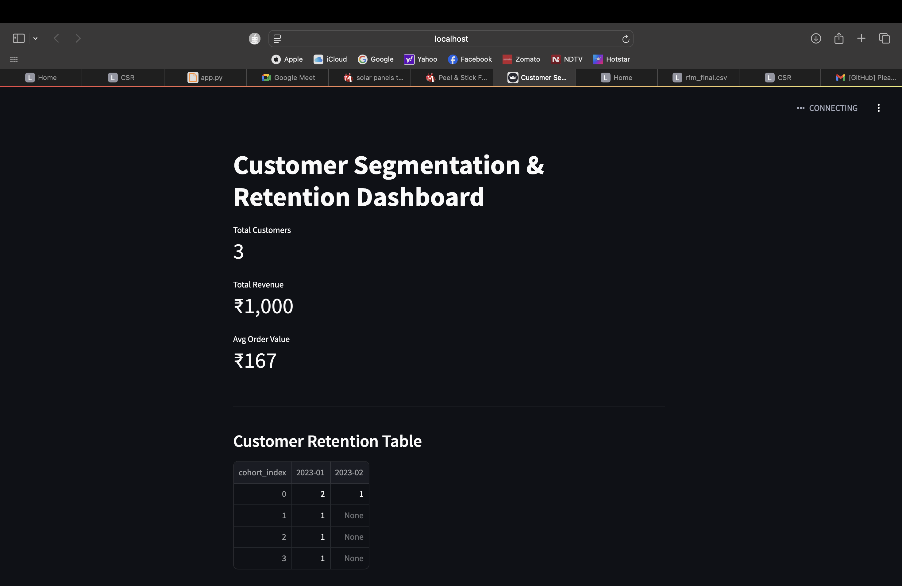

# Customer Segmentation & Retention Analysis

## Objective
The goal of this project is to segment customers based on purchasing behavior and analyze retention patterns to improve customer loyalty and reduce churn.

## Dataset
Simulated transactional customer data containing:
- Customer ID
- Order date
- Order amount

## Methodology
- RFM feature engineering (Recency, Frequency, Monetary)
- Customer segmentation using K-Means clustering
- Churn identification based on recency
- Cohort-based retention analysis

## Key Insights
- Identified high-value and churn-prone customer segments
- Observed retention patterns across customer cohorts
- Provided actionable business recommendations

## Tech Stack
- Python
- Pandas
- Scikit-learn
- Matplotlib
## Interactive Dashboard (Streamlit)
# Customer Segmentation & Retention Analysis

This project analyzes customer behavior using RFM segmentation and cohort-based retention analysis.

## Features
- RFM-based customer segmentation
- Cohort analysis for retention tracking
- Interactive Streamlit dashboard
- Real-world business insights

## Tech Stack
- Python
- Pandas, NumPy
- Scikit-learn
- Matplotlib
- Streamlit

## Dashboard Preview

### Customer Segmentation Dashboard

